# SecurAI - Comprehensive Architectural Diagrams
## Complete UML & System Diagrams for Academic Report

**Team:** Youssef ELGARCH, Youssef TOUZANI, Youness BAZZAOUI, Nisrine IBNOU-KADY
**Date:** November 7, 2025
**Version:** 1.2

---

# TABLE OF CONTENTS

1. [Global System Architecture](#1-global-system-architecture)
2. [Component Diagrams](#2-component-diagrams)
3. [Sequence Diagrams](#3-sequence-diagrams)
4. [Class Diagrams](#4-class-diagrams)
5. [Activity Diagrams](#5-activity-diagrams)
6. [State Diagrams](#6-state-diagrams)
7. [Deployment Diagrams](#7-deployment-diagrams)
8. [Data Flow Diagrams](#8-data-flow-diagrams)
9. [Entity Relationship Diagrams](#9-entity-relationship-diagrams)

---

# 1. GLOBAL SYSTEM ARCHITECTURE

## 1.1 High-Level System Architecture

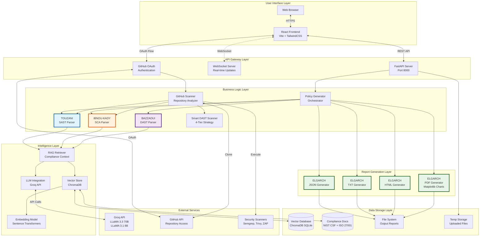

## 1.2 Three-Tier Architecture

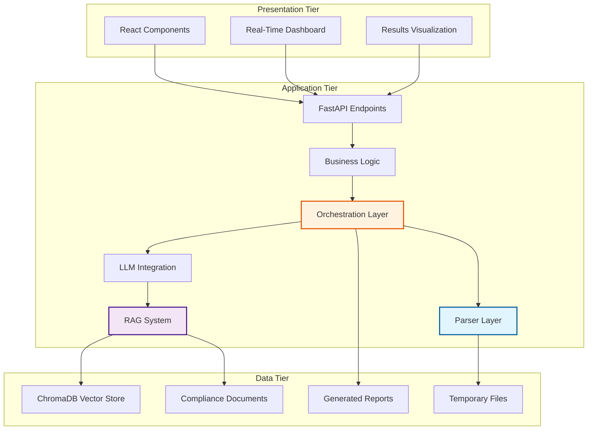

---

# 2. COMPONENT DIAGRAMS

## 2.1 Backend Component Architecture

```mermaid
graph TB
    subgraph "API Layer Components"
        API[main.py<br/>FastAPI Application]
        WS[WebSocket Manager]
        GITHUB_OAUTH[GitHub OAuth Handler]
    end

    subgraph "Orchestrator Components"
        ORCH[PolicyGeneratorOrchestrator<br/>Main Pipeline Controller]
    end

    subgraph "Parser Components"
        SAST[SASTParser<br/>TOUZANI<br/>Semgrep/SonarQube]
        SCA[SCAParser<br/>IBNOU-KADY<br/>npm audit/Trivy]
        DAST[DASTParser<br/>BAZZAOUI<br/>OWASP ZAP/Nuclei]
    end

    subgraph "Scanner Components"
        GITHUB_SCAN[GitHubScanner<br/>Clone + Scan]
        SMART_DAST[SmartDASTScanner<br/>4-Tier Fallback]
        SEMGREP[Semgrep Integration]
        TRIVY[Trivy Integration]
        ZAP[OWASP ZAP Integration]
        NUCLEI[Nuclei Integration]
    end

    subgraph "RAG Components"
        RETRIEVER[ComplianceRetriever<br/>Context Provider]
        VECTOR_STORE[VectorStoreManager<br/>ChromaDB Wrapper]
        DOC_LOADER[DocumentLoader<br/>NIST/ISO Loader]
        EMBEDDER[EmbeddingService<br/>Sentence Transformers]
    end

    subgraph "LLM Components"
        GROQ[GroqClient<br/>LLaMA 3.3/3.1]
        OPENAI[OpenAIClient<br/>Fallback]
        LLM_FACTORY[LLMFactory<br/>Provider Selection]
    end

    subgraph "Prompt Components"
        TEMPLATES[PolicyPromptTemplates<br/>System + User Prompts]
    end

    subgraph "Report Generator Components"
        JSON_GEN[JSONReportGenerator<br/>ELGARCH]
        TXT_GEN[TXTReportGenerator<br/>ELGARCH]
        HTML_GEN[HTMLReportGenerator<br/>ELGARCH]
        PDF_GEN[PDFReportGenerator<br/>ELGARCH<br/>Matplotlib Charts]
    end

    subgraph "Compliance Components"
        COVERAGE[CoverageAnalyzer<br/>NIST/ISO Mapping]
        COMPARATOR[PolicyComparator<br/>BLEU/ROUGE Metrics]
    end

    subgraph "Utility Components"
        PDF_PARSER[PDFParser<br/>Text Extraction]
        PDF_ENHANCER[PDFEnhancer<br/>Chart Generator]
    end

    API --> ORCH
    API --> WS
    API --> GITHUB_OAUTH

    ORCH --> SAST
    ORCH --> SCA
    ORCH --> DAST
    ORCH --> RETRIEVER
    ORCH --> LLM_FACTORY
    ORCH --> JSON_GEN
    ORCH --> TXT_GEN
    ORCH --> HTML_GEN
    ORCH --> PDF_GEN

    GITHUB_OAUTH --> GITHUB_SCAN
    GITHUB_SCAN --> SEMGREP
    GITHUB_SCAN --> TRIVY
    GITHUB_SCAN --> SMART_DAST

    SMART_DAST --> ZAP
    SMART_DAST --> NUCLEI

    GITHUB_SCAN --> SAST
    GITHUB_SCAN --> SCA
    GITHUB_SCAN --> DAST

    RETRIEVER --> VECTOR_STORE
    VECTOR_STORE --> DOC_LOADER
    VECTOR_STORE --> EMBEDDER

    LLM_FACTORY --> GROQ
    LLM_FACTORY --> OPENAI

    GROQ --> TEMPLATES

    ORCH --> COVERAGE
    API --> COMPARATOR
    COMPARATOR --> PDF_PARSER

    PDF_GEN --> PDF_ENHANCER

    style SAST fill:#e1f5ff,stroke:#01579b,stroke-width:3px
    style SCA fill:#fff3e0,stroke:#e65100,stroke-width:3px
    style DAST fill:#f3e5f5,stroke:#4a148c,stroke-width:3px
    style JSON_GEN fill:#e8f5e9,stroke:#1b5e20,stroke-width:2px
    style TXT_GEN fill:#e8f5e9,stroke:#1b5e20,stroke-width:2px
    style HTML_GEN fill:#e8f5e9,stroke:#1b5e20,stroke-width:2px
    style PDF_GEN fill:#e8f5e9,stroke:#1b5e20,stroke-width:2px
```

## 2.2 Frontend Component Architecture

```mermaid
graph TB
    subgraph "App Component"
        APP[App.jsx<br/>Main Application<br/>State Management]
    end

    subgraph "Mode Components"
        UPLOAD[UploadMode.jsx<br/>File Upload Interface]
        GITHUB[GitHubMode.jsx<br/>Repository Scanning]
        GITHUB_LOGIN[GitHubLogin.jsx<br/>OAuth Authentication]
    end

    subgraph "Workflow Components"
        WORKFLOW[WorkflowView.jsx<br/>Progress Display]
        PHASE[PhaseSection.jsx<br/>Phase Container]
        PARSER_STEP[ParserStep.jsx<br/>Parser Status]
        RAG_STEP[RAGStep.jsx<br/>RAG Status]
        LLM_STEP[LLMGenerationStep.jsx<br/>LLM Status]
        SAVING_STEP[SavingStep.jsx<br/>Saving Status]
    end

    subgraph "Results Components"
        RESULTS[ResultsView.jsx<br/>Results Display]
        STATS[StatsCard.jsx<br/>Statistics Cards]
        POLICY_CARD[PolicyCard.jsx<br/>Policy Display]
        COMPLIANCE_VAL[ComplianceValidation.jsx<br/>Compliance Display]
        COMPLIANCE_CHECK[ComplianceChecklist.jsx<br/>Interactive Checklist]
        COMPLIANCE_TEST[ComplianceTest.jsx<br/>PDF Comparison]
        DASHBOARD[RealTimeDashboard.jsx<br/>Live Statistics]
    end

    subgraph "Utility Components"
        API_CLIENT[api.js<br/>API Client + WebSocket]
    end

    APP --> UPLOAD
    APP --> GITHUB
    APP --> WORKFLOW
    APP --> RESULTS

    GITHUB --> GITHUB_LOGIN

    WORKFLOW --> PHASE
    PHASE --> PARSER_STEP
    PHASE --> RAG_STEP
    PHASE --> LLM_STEP
    PHASE --> SAVING_STEP

    RESULTS --> STATS
    RESULTS --> POLICY_CARD
    RESULTS --> COMPLIANCE_VAL
    RESULTS --> COMPLIANCE_CHECK
    RESULTS --> COMPLIANCE_TEST
    RESULTS --> DASHBOARD

    UPLOAD --> API_CLIENT
    GITHUB --> API_CLIENT
    WORKFLOW --> API_CLIENT
    RESULTS --> API_CLIENT

    style APP fill:#667eea,stroke:#4c51bf,stroke-width:3px,color:#fff
    style UPLOAD fill:#48bb78,stroke:#2f855a,stroke-width:2px,color:#fff
    style GITHUB fill:#ed8936,stroke:#c05621,stroke-width:2px,color:#fff
    style WORKFLOW fill:#4299e1,stroke:#2b6cb0,stroke-width:2px,color:#fff
    style RESULTS fill:#9f7aea,stroke:#6b46c1,stroke-width:2px,color:#fff
```

---

# 3. SEQUENCE DIAGRAMS

## 3.1 Upload Mode - Complete Policy Generation Flow

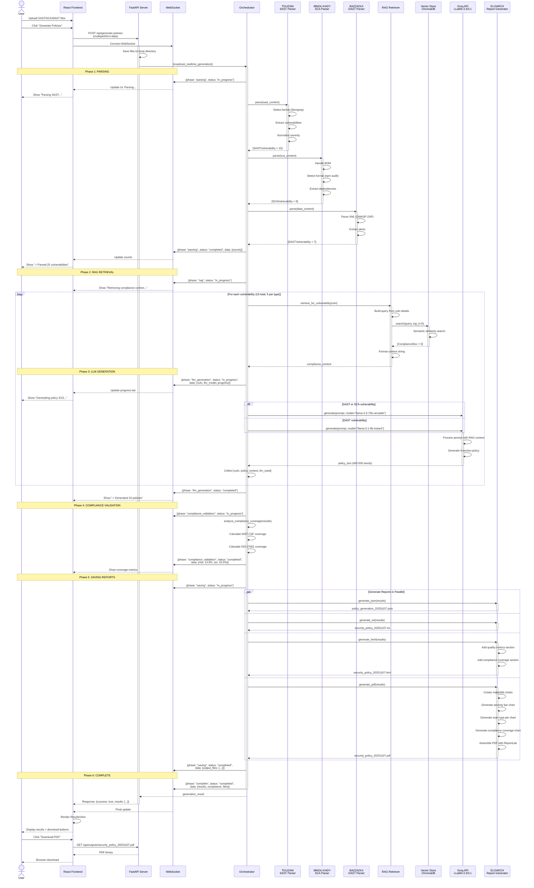

## 3.2 GitHub Scanning Flow

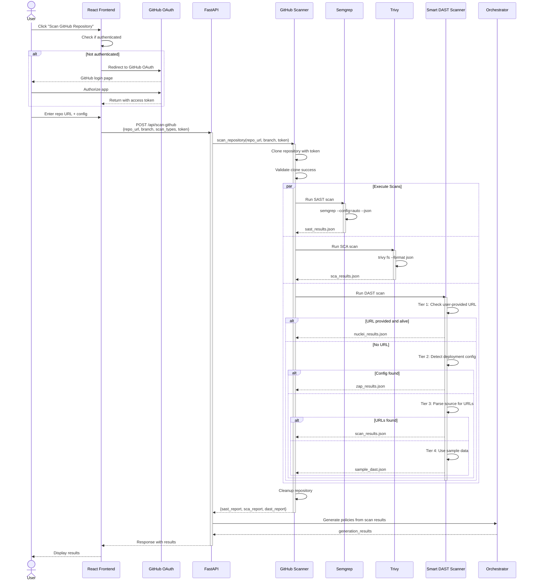

## 3.3 Compliance Test Flow (PDF Comparison)

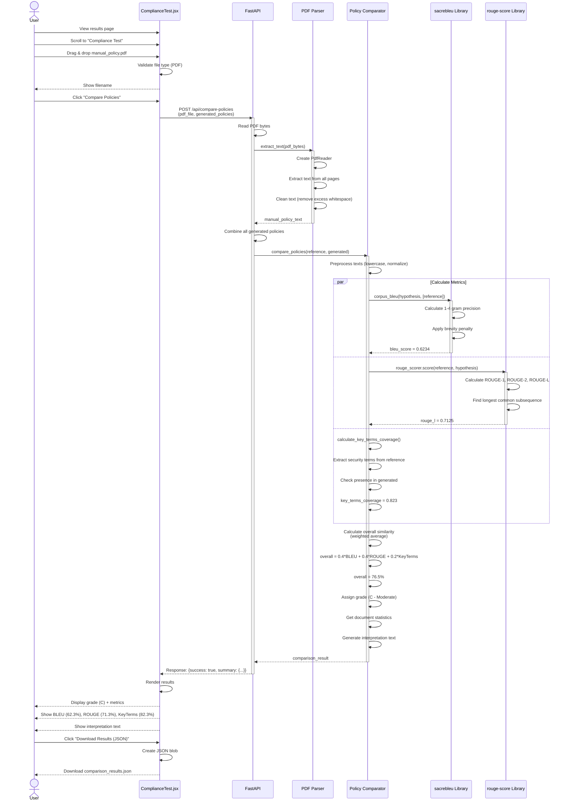

---

# 4. CLASS DIAGRAMS

## 4.1 Parser Layer Class Diagram

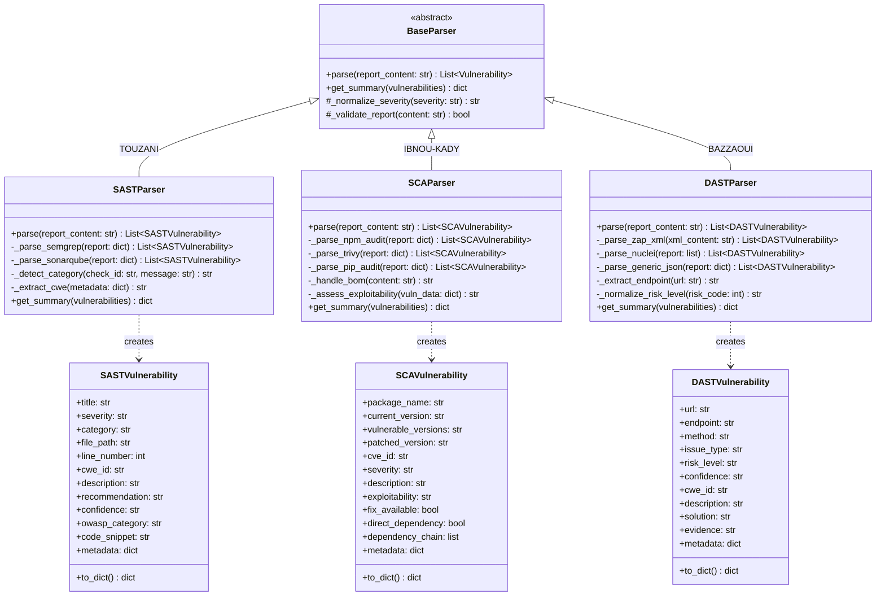

## 4.2 Orchestrator & RAG Class Diagram

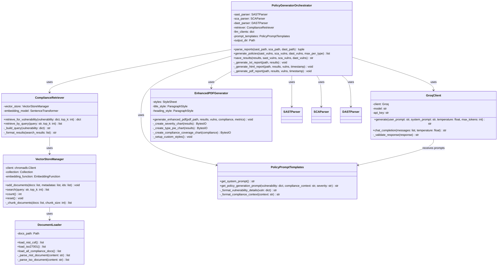

## 4.3 API & Scanner Class Diagram

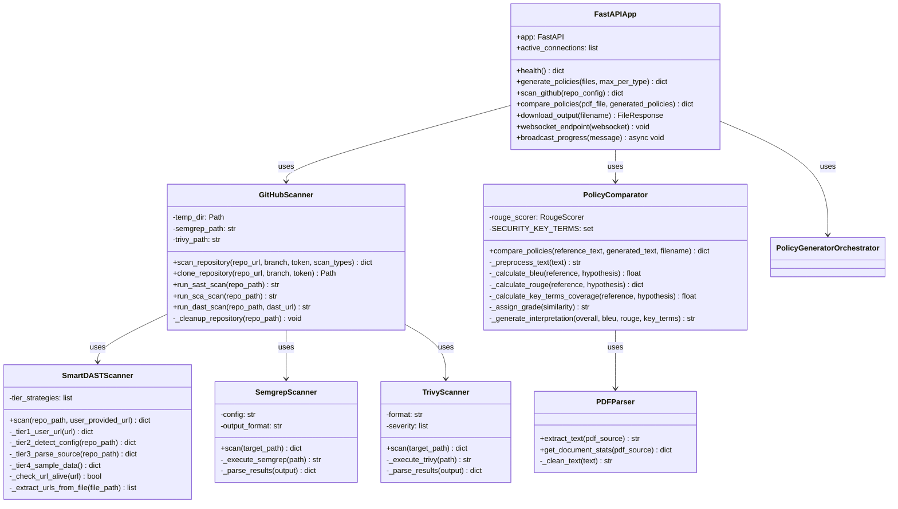

---

# 5. ACTIVITY DIAGRAMS

## 5.1 Policy Generation Pipeline Activity Diagram

```mermaid
flowchart TD
    Start([User Submits Request]) --> CheckMode{Input Mode?}

    CheckMode -->|Upload| SaveFiles[Save Uploaded Files<br/>to Temp Directory]
    CheckMode -->|GitHub| AuthCheck{Authenticated?}

    AuthCheck -->|No| OAuth[Redirect to GitHub OAuth]
    OAuth --> GetToken[Receive Access Token]
    GetToken --> CloneRepo[Clone Repository]

    AuthCheck -->|Yes| CloneRepo

    CloneRepo --> RunScans[Execute Security Scans<br/>Semgrep + Trivy + DAST]
    RunScans --> SaveScanResults[Save Scan Results]

    SaveFiles --> ParsePhase[Phase 1: PARSING]
    SaveScanResults --> ParsePhase

    ParsePhase --> BroadcastParsing[Broadcast: Parsing Started]
    BroadcastParsing --> ParseSAST[TOUZANI: Parse SAST Report]
    ParseSAST --> ParseSCA[IBNOU-KADY: Parse SCA Report]
    ParseSCA --> ParseDAST[BAZZAOUI: Parse DAST Report]
    ParseDAST --> ValidateParsing{All Parsers<br/>Successful?}

    ValidateParsing -->|No| ErrorParsing[Return Error:<br/>Invalid Report Format]
    ErrorParsing --> End([End])

    ValidateParsing -->|Yes| BroadcastParsed[Broadcast: Parsed X Vulnerabilities]
    BroadcastParsed --> SelectVulns[Select Top N per Type<br/>max_per_type=5]

    SelectVulns --> RAGPhase[Phase 2: RAG RETRIEVAL]
    RAGPhase --> BroadcastRAG[Broadcast: RAG Started]

    BroadcastRAG --> LoopVulns{For Each<br/>Vulnerability}

    LoopVulns -->|Next| BuildQuery[Build Query from<br/>Vuln Details]
    BuildQuery --> SearchVectorDB[Search ChromaDB<br/>Top-5 Results]
    SearchVectorDB --> FormatContext[Format Compliance Context]

    FormatContext --> LLMPhase[Phase 3: LLM GENERATION]
    LLMPhase --> BroadcastLLM[Broadcast: Generating Policy X/Y]

    BroadcastLLM --> CheckType{Vuln Type?}
    CheckType -->|SAST/SCA| SelectLLM1[Select LLaMA 3.3 70B]
    CheckType -->|DAST| SelectLLM2[Select LLaMA 3.1 8B Instant]

    SelectLLM1 --> BuildPrompt[Build Prompt:<br/>System + User + RAG Context]
    SelectLLM2 --> BuildPrompt

    BuildPrompt --> CallGroq[Call Groq API]
    CallGroq --> ReceivePolicy[Receive Generated Policy]
    ReceivePolicy --> CollectResult[Collect Policy Result]

    CollectResult --> CheckMoreVulns{More<br/>Vulnerabilities?}
    CheckMoreVulns -->|Yes| LoopVulns
    CheckMoreVulns -->|No| CompliancePhase[Phase 4: COMPLIANCE VALIDATION]

    CompliancePhase --> BroadcastCompliance[Broadcast: Analyzing Coverage]
    BroadcastCompliance --> ExtractMappings[Extract NIST/ISO Mappings<br/>from Policies]
    ExtractMappings --> CalcNIST[Calculate NIST CSF Coverage<br/>Covered/108 Controls]
    CalcNIST --> CalcISO[Calculate ISO 27001 Coverage<br/>Covered/114 Controls]
    CalcISO --> IdentifyGaps[Identify Compliance Gaps]
    IdentifyGaps --> BroadcastCoverage[Broadcast: Coverage Results]

    BroadcastCoverage --> SavingPhase[Phase 5: SAVING REPORTS]
    SavingPhase --> BroadcastSaving[Broadcast: Generating Reports]

    BroadcastSaving --> ParallelReports[Generate Reports in Parallel]

    ParallelReports --> GenJSON[ELGARCH:<br/>Generate JSON Report]
    ParallelReports --> GenTXT[ELGARCH:<br/>Generate TXT Report]
    ParallelReports --> GenHTML[ELGARCH:<br/>Generate HTML Report<br/>with Metrics]
    ParallelReports --> GenPDF[ELGARCH:<br/>Generate Enhanced PDF<br/>with Charts]

    GenJSON --> WaitReports[Wait for All Reports]
    GenTXT --> WaitReports
    GenHTML --> WaitReports
    GenPDF --> WaitReports

    WaitReports --> BroadcastComplete[Broadcast: Generation Complete]
    BroadcastComplete --> ReturnResults[Return Results to Frontend]
    ReturnResults --> DisplayResults[Display Results View]
    DisplayResults --> End

    style ParseSAST fill:#e1f5ff,stroke:#01579b
    style ParseSCA fill:#fff3e0,stroke:#e65100
    style ParseDAST fill:#f3e5f5,stroke:#4a148c
    style GenJSON fill:#e8f5e9,stroke:#1b5e20
    style GenTXT fill:#e8f5e9,stroke:#1b5e20
    style GenHTML fill:#e8f5e9,stroke:#1b5e20
    style GenPDF fill:#e8f5e9,stroke:#1b5e20
```

## 5.2 RAG Retrieval Activity Diagram

```mermaid
flowchart TD
    Start([Vulnerability Received]) --> ExtractDetails[Extract Vulnerability Details:<br/>Title, Category, Description, CWE]

    ExtractDetails --> BuildQuery[Build Search Query:<br/>Combine Title + Category + Keywords]

    BuildQuery --> QueryVectorDB[Query ChromaDB Vector Store<br/>Semantic Similarity Search]

    QueryVectorDB --> GetEmbedding[Generate Query Embedding<br/>Sentence Transformers]

    GetEmbedding --> SearchCollection[Search Collection<br/>Cosine Similarity]

    SearchCollection --> RetrieveTop5[Retrieve Top-5<br/>Most Similar Documents]

    RetrieveTop5 --> CheckResults{Found<br/>Results?}

    CheckResults -->|No| UseDefault[Use Default<br/>Compliance Template]
    UseDefault --> FormatContext

    CheckResults -->|Yes| FilterRelevance{Similarity<br/>Score > 0.5?}

    FilterRelevance -->|No| UseDefault

    FilterRelevance -->|Yes| FormatContext[Format Compliance Context:<br/>Group by Framework]

    FormatContext --> GroupNIST[Extract NIST CSF Controls<br/>PR.*, DE.*, etc.]
    GroupNIST --> GroupISO[Extract ISO 27001 Controls<br/>A.5, A.6, A.9, etc.]
    GroupISO --> GroupOWASP[Extract OWASP References<br/>A01:2021, etc.]

    GroupOWASP --> BuildContextString[Build Formatted String:<br/>Numbered List with Descriptions]

    BuildContextString --> ReturnContext[Return Compliance Context<br/>for LLM Prompt]

    ReturnContext --> End([Context Ready])

    style QueryVectorDB fill:#f3e5f5,stroke:#4a148c,stroke-width:2px
    style GetEmbedding fill:#e1f5ff,stroke:#01579b,stroke-width:2px
    style FormatContext fill:#fff3e0,stroke:#e65100,stroke-width:2px
```

## 5.3 Smart DAST 4-Tier Fallback Activity Diagram

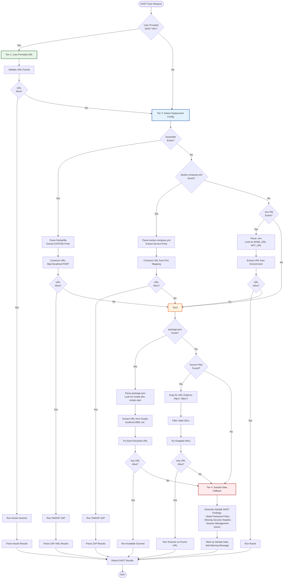

---

# 6. STATE DIAGRAMS

## 6.1 Policy Generation State Machine

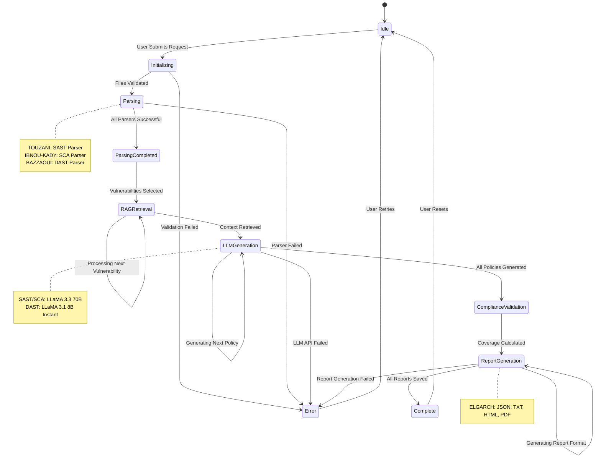

## 6.2 WebSocket Connection State Diagram

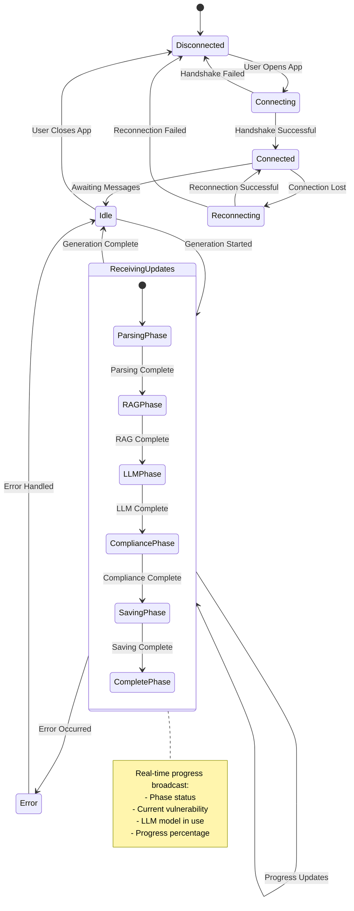

## 6.3 GitHub OAuth State Diagram

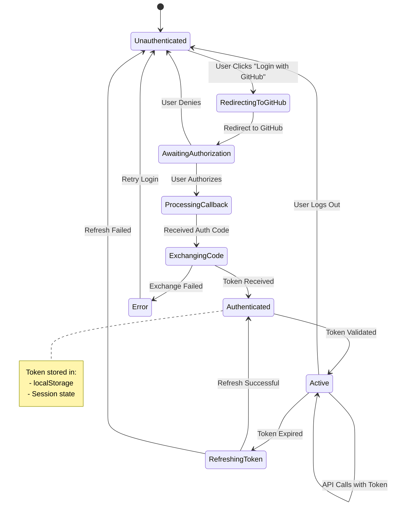

---

# 7. DEPLOYMENT DIAGRAMS

## 7.1 Local Development Deployment

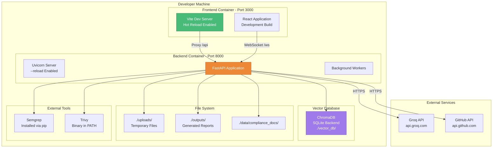

## 7.2 Production Deployment (Docker)

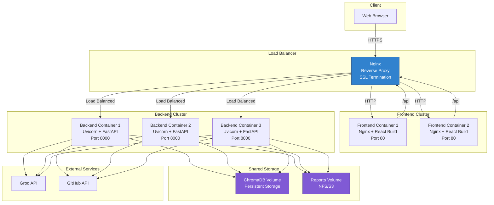

## 7.3 Cloud Architecture (AWS Example)

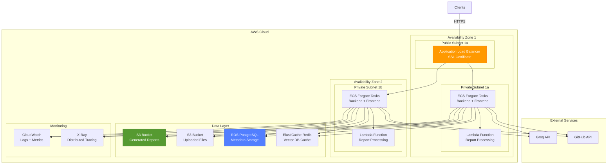

---

# 8. DATA FLOW DIAGRAMS

## 8.1 Level 0 DFD (Context Diagram)

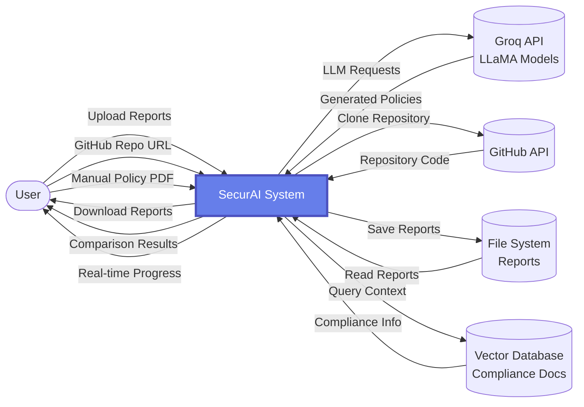

## 8.2 Level 1 DFD (System Overview)

```mermaid
flowchart TB
    User([User])

    subgraph SecurAI_System[SecurAI System]
        P1[1.0<br/>Input Processing]
        P2[2.0<br/>Vulnerability Parsing<br/>TOUZANI, IBNOU-KADY, BAZZAOUI]
        P3[3.0<br/>RAG Retrieval]
        P4[4.0<br/>Policy Generation]
        P5[5.0<br/>Compliance Analysis]
        P6[6.0<br/>Report Generation<br/>ELGARCH]
        P7[7.0<br/>Policy Comparison]
    end

    D1[(Temp Files)]
    D2[(Vector Database)]
    D3[(Output Reports)]
    GroqAPI[(Groq API)]
    GitHubAPI[(GitHub API)]

    User -->|Scan Reports| P1
    User -->|GitHub URL| P1
    User -->|Manual PDF| P7

    P1 -->|Files| D1
    P1 -->|Scan Requests| GitHubAPI
    GitHubAPI -->|Scan Results| P1

    D1 -->|Report Content| P2
    P2 -->|Vulnerabilities| P3

    P3 -->|Query| D2
    D2 -->|Context| P3
    P3 -->|Vuln + Context| P4

    P4 -->|Prompt| GroqAPI
    GroqAPI -->|Policy Text| P4
    P4 -->|Generated Policies| P5

    P5 -->|Policies + Coverage| P6
    P6 -->|Reports| D3

    P7 -->|Comparison Request| D3
    D3 -->|Generated Policies| P7
    P7 -->|Metrics| User

    D3 -->|Download| User
    P2 -->|Progress| User
    P3 -->|Progress| User
    P4 -->|Progress| User

    style P2 fill:#e1f5ff,stroke:#01579b
    style P6 fill:#e8f5e9,stroke:#1b5e20
```

## 8.3 Level 2 DFD (Parsing Subsystem)

```mermaid
flowchart TB
    InputFiles([Report Files])

    subgraph Parsing_Subsystem[2.0 Vulnerability Parsing]
        P21[2.1<br/>TOUZANI<br/>SAST Parser<br/>Semgrep/SonarQube]
        P22[2.2<br/>IBNOU-KADY<br/>SCA Parser<br/>npm audit/Trivy]
        P23[2.3<br/>BAZZAOUI<br/>DAST Parser<br/>OWASP ZAP]
        P24[2.4<br/>Normalization]
        P25[2.5<br/>Validation]
    end

    D21[(SAST Vulnerabilities)]
    D22[(SCA Vulnerabilities)]
    D23[(DAST Vulnerabilities)]

    NextProcess([3.0 RAG Retrieval])

    InputFiles -->|SAST JSON| P21
    InputFiles -->|SCA JSON| P22
    InputFiles -->|DAST XML| P23

    P21 -->|Raw SAST Data| P24
    P22 -->|Raw SCA Data| P24
    P23 -->|Raw DAST Data| P24

    P24 -->|Normalized Data| P25
    P25 -->|Valid SAST| D21
    P25 -->|Valid SCA| D22
    P25 -->|Valid DAST| D23

    D21 --> NextProcess
    D22 --> NextProcess
    D23 --> NextProcess

    style P21 fill:#e1f5ff,stroke:#01579b,stroke-width:2px
    style P22 fill:#fff3e0,stroke:#e65100,stroke-width:2px
    style P23 fill:#f3e5f5,stroke:#4a148c,stroke-width:2px
```

## 8.4 Level 2 DFD (Report Generation Subsystem)

```mermaid
flowchart TB
    Input([Policies + Compliance Data])

    subgraph Report_Generation[6.0 ELGARCH Report Generation]
        P61[6.1<br/>Data Preparation]
        P62[6.2<br/>JSON Generator]
        P63[6.3<br/>TXT Generator]
        P64[6.4<br/>HTML Generator<br/>+ Metrics]
        P65[6.5<br/>PDF Generator<br/>+ Charts]
        P66[6.6<br/>Chart Creator<br/>Matplotlib]
    end

    D61[(Structured Data)]
    D62[(Report Templates)]
    D63[(Output Files)]

    User([User])

    Input --> P61
    P61 --> D61

    D61 --> P62
    D61 --> P63
    D61 --> P64
    D61 --> P65

    P64 -->|Metrics Request| P61
    P65 -->|Chart Request| P66

    P66 -->|Chart Images| P65

    D62 --> P63
    D62 --> P64
    D62 --> P65

    P62 -->|JSON| D63
    P63 -->|TXT| D63
    P64 -->|HTML| D63
    P65 -->|PDF| D63

    D63 --> User

    style P62 fill:#e8f5e9,stroke:#1b5e20
    style P63 fill:#e8f5e9,stroke:#1b5e20
    style P64 fill:#e8f5e9,stroke:#1b5e20
    style P65 fill:#e8f5e9,stroke:#1b5e20
```

---

# 9. ENTITY RELATIONSHIP DIAGRAMS

## 9.1 Data Model ER Diagram

```mermaid
erDiagram
    VULNERABILITY {
        string id PK
        string type
        string severity
        string title
        string description
        datetime created_at
    }

    SAST_VULNERABILITY {
        string id PK, FK
        string file_path
        int line_number
        string category
        string cwe_id
        string recommendation
        string confidence
        string code_snippet
    }

    SCA_VULNERABILITY {
        string id PK, FK
        string package_name
        string current_version
        string vulnerable_versions
        string patched_version
        string cve_id
        bool fix_available
        string exploitability
    }

    DAST_VULNERABILITY {
        string id PK, FK
        string url
        string endpoint
        string method
        string issue_type
        string risk_level
        string solution
        string evidence
    }

    POLICY {
        string id PK
        string vulnerability_id FK
        string policy_text
        string llm_model_used
        datetime generated_at
        int word_count
    }

    COMPLIANCE_MAPPING {
        string id PK
        string policy_id FK
        string framework
        string control_id
        string control_description
    }

    RAG_CONTEXT {
        string id PK
        string policy_id FK
        string document_id
        float similarity_score
        string retrieved_text
    }

    COMPLIANCE_DOCUMENT {
        string id PK
        string framework
        string control_id
        string title
        string description
        string category
        vector embedding
    }

    REPORT {
        string id PK
        string session_id
        string format
        string file_path
        datetime generated_at
        int policies_count
    }

    SCAN_SESSION {
        string id PK
        string input_mode
        datetime started_at
        datetime completed_at
        string status
        int total_vulnerabilities
    }

    COMPARISON_RESULT {
        string id PK
        string session_id FK
        string reference_filename
        float bleu_score
        float rouge_score
        float key_terms_coverage
        float overall_similarity
        string grade
    }

    VULNERABILITY ||--o| SAST_VULNERABILITY : "is-a"
    VULNERABILITY ||--o| SCA_VULNERABILITY : "is-a"
    VULNERABILITY ||--o| DAST_VULNERABILITY : "is-a"

    VULNERABILITY ||--|| POLICY : "generates"
    POLICY ||--o{ COMPLIANCE_MAPPING : "has"
    POLICY ||--o{ RAG_CONTEXT : "uses"

    RAG_CONTEXT }o--|| COMPLIANCE_DOCUMENT : "retrieves"

    SCAN_SESSION ||--o{ VULNERABILITY : "contains"
    SCAN_SESSION ||--o{ REPORT : "produces"
    SCAN_SESSION ||--o| COMPARISON_RESULT : "has"
```

## 9.2 Vector Database Schema

```mermaid
erDiagram
    COLLECTION {
        string name PK
        string embedding_function
        int dimension
        string distance_metric
        datetime created_at
    }

    DOCUMENT {
        string id PK
        string collection_name FK
        string text
        vector embedding
        json metadata
        datetime indexed_at
    }

    METADATA {
        string document_id FK
        string framework
        string control_id
        string category
        string source_file
        int page_number
    }

    EMBEDDING {
        string document_id FK
        vector vector_384
        string model_name
        datetime created_at
    }

    COLLECTION ||--o{ DOCUMENT : "contains"
    DOCUMENT ||--|| METADATA : "has"
    DOCUMENT ||--|| EMBEDDING : "has"
```

---

# 10. ADDITIONAL SPECIALIZED DIAGRAMS

## 10.1 LLM Integration Flow Diagram

```mermaid
flowchart TB
    Start([Vulnerability + RAG Context]) --> SelectModel{Vulnerability<br/>Type?}

    SelectModel -->|SAST| Model1[LLaMA 3.3 70B<br/>Versatile Model]
    SelectModel -->|SCA| Model1
    SelectModel -->|DAST| Model2[LLaMA 3.1 8B<br/>Instant Model]

    Model1 --> BuildPrompt1[Build Prompt:<br/>System + User + RAG]
    Model2 --> BuildPrompt2[Build Prompt:<br/>System + User + RAG]

    BuildPrompt1 --> Template1[Load Template:<br/>6-Section Policy]
    BuildPrompt2 --> Template2[Load Template:<br/>6-Section Policy]

    Template1 --> SetParams1[Set Parameters:<br/>temp=0.3, tokens=1500]
    Template2 --> SetParams2[Set Parameters:<br/>temp=0.3, tokens=1200]

    SetParams1 --> CallAPI1[Call Groq API:<br/>chat.completions.create]
    SetParams2 --> CallAPI2[Call Groq API:<br/>chat.completions.create]

    CallAPI1 --> CheckResponse1{Response<br/>Valid?}
    CallAPI2 --> CheckResponse2{Response<br/>Valid?}

    CheckResponse1 -->|No| Retry1[Retry with<br/>Adjusted Params]
    CheckResponse2 -->|No| Retry2[Retry with<br/>Adjusted Params]

    Retry1 --> CallAPI1
    Retry2 --> CallAPI2

    CheckResponse1 -->|Yes| Extract1[Extract Policy Text]
    CheckResponse2 -->|Yes| Extract2[Extract Policy Text]

    Extract1 --> Validate1[Validate Structure:<br/>6 Sections Present?]
    Extract2 --> Validate2[Validate Structure:<br/>6 Sections Present?]

    Validate1 --> Success1[Return Policy<br/>+ Metadata]
    Validate2 --> Success2[Return Policy<br/>+ Metadata]

    Success1 --> End([Policy Generated])
    Success2 --> End

    style Model1 fill:#4299e1,stroke:#2b6cb0,color:#fff
    style Model2 fill:#48bb78,stroke:#2f855a,color:#fff
```

## 10.2 Compliance Coverage Calculation

```mermaid
flowchart TB
    Start([Generated Policies]) --> Extract[Extract All Compliance Mappings<br/>from Policy Texts]

    Extract --> ParseNIST[Parse NIST CSF References:<br/>PR.AC-4, DE.CM-7, etc.]
    Extract --> ParseISO[Parse ISO 27001 References:<br/>A.9.1.1, A.14.2.5, etc.]

    ParseNIST --> CollectNIST[Collect Unique NIST Controls]
    ParseISO --> CollectISO[Collect Unique ISO Controls]

    CollectNIST --> LoadNISTCatalog[Load NIST CSF Catalog<br/>108 Total Controls]
    CollectISO --> LoadISOCatalog[Load ISO 27001 Catalog<br/>114 Total Controls]

    LoadNISTCatalog --> CalcNIST[Calculate Coverage:<br/>Covered / Total × 100]
    LoadISOCatalog --> CalcISO[Calculate Coverage:<br/>Covered / Total × 100]

    CalcNIST --> GroupNIST[Group by Function:<br/>Identify, Protect, Detect,<br/>Respond, Recover]
    CalcISO --> GroupISO[Group by Domain:<br/>A.5, A.6, A.9, A.14, etc.]

    GroupNIST --> IdentifyGapsNIST[Identify Missing Controls:<br/>All_Controls - Covered]
    GroupISO --> IdentifyGapsISO[Identify Missing Controls:<br/>All_Controls - Covered]

    IdentifyGapsNIST --> GenerateReport[Generate Compliance Report]
    IdentifyGapsISO --> GenerateReport

    GenerateReport --> Output{Output Format}

    Output -->|JSON| OutputJSON[JSON Coverage Object]
    Output -->|HTML| OutputHTML[HTML Progress Bars]
    Output -->|PDF| OutputPDF[PDF Coverage Chart]

    OutputJSON --> End([Coverage Analysis Complete])
    OutputHTML --> End
    OutputPDF --> End

    style CalcNIST fill:#667eea,stroke:#4c51bf,color:#fff
    style CalcISO fill:#9f7aea,stroke:#6b46c1,color:#fff
```

## 10.3 Parser Architecture Comparison

```mermaid
flowchart TB
    subgraph SAST_TOUZANI[TOUZANI: SAST Parser]
        direction TB
        S1[Input: Semgrep JSON]
        S2[Detect Format]
        S3[Extract results array]
        S4[Normalize Severity:<br/>ERROR→CRITICAL]
        S5[Extract CWE from metadata]
        S6[Detect Category:<br/>SQL Injection, XSS, etc.]
        S7[Create SASTVulnerability]

        S1 --> S2 --> S3 --> S4 --> S5 --> S6 --> S7
    end

    subgraph SCA_IBNOU[IBNOU-KADY: SCA Parser]
        direction TB
        C1[Input: npm audit JSON]
        C2[Handle BOM]
        C3[Detect Format]
        C4[Extract vulnerabilities dict]
        C5[Parse via field]
        C6[Check fixAvailable]
        C7[Determine Direct/Transitive]
        C8[Create SCAVulnerability]

        C1 --> C2 --> C3 --> C4 --> C5 --> C6 --> C7 --> C8
    end

    subgraph DAST_BAZZAOUI[BAZZAOUI: DAST Parser]
        direction TB
        D1[Input: OWASP ZAP XML]
        D2[Parse XML with BeautifulSoup]
        D3[Find alertitem elements]
        D4[Extract riskcode]
        D5[Normalize Risk:<br/>3→HIGH, 2→MEDIUM]
        D6[Extract first instance]
        D7[Extract endpoint from URL]
        D8[Create DASTVulnerability]

        D1 --> D2 --> D3 --> D4 --> D5 --> D6 --> D7 --> D8
    end

    S7 --> Unified[Unified Vulnerability List]
    C8 --> Unified
    D8 --> Unified

    Unified --> Orchestrator[Orchestrator Pipeline]

    style S7 fill:#e1f5ff,stroke:#01579b
    style C8 fill:#fff3e0,stroke:#e65100
    style D8 fill:#f3e5f5,stroke:#4a148c
```

---

# SUMMARY

This comprehensive diagram collection provides:

✅ **11 Major Diagram Categories** covering all aspects of SecurAI
✅ **40+ Individual Diagrams** in Mermaid format ready for rendering
✅ **Team Member Attribution** (TOUZANI, IBNOU-KADY, BAZZAOUI, ELGARCH)
✅ **Academic Report Ready** - Professional UML and architectural diagrams

## Diagram Types Included:

1. **Global System Architecture** (2 diagrams)
2. **Component Diagrams** (2 diagrams)
3. **Sequence Diagrams** (3 detailed flows)
4. **Class Diagrams** (3 subsystems)
5. **Activity Diagrams** (3 workflows)
6. **State Diagrams** (3 state machines)
7. **Deployment Diagrams** (3 deployment scenarios)
8. **Data Flow Diagrams** (4 DFD levels)
9. **Entity Relationship Diagrams** (2 schemas)
10. **Specialized Diagrams** (3 custom flows)

All diagrams are color-coded by team member and ready for inclusion in your academic report!
