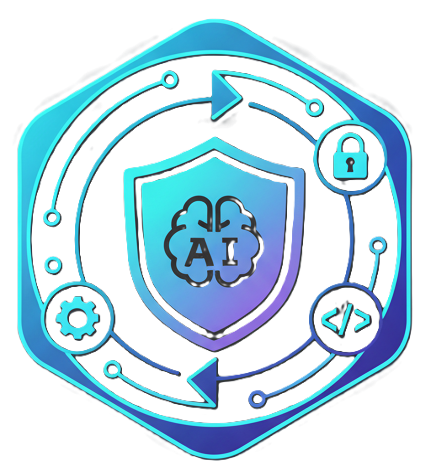
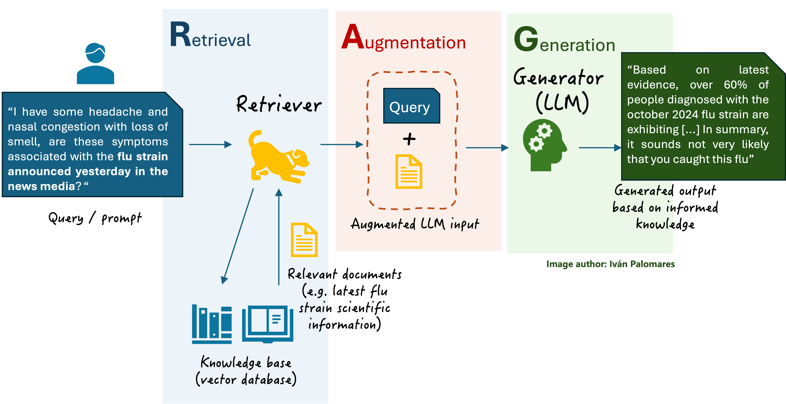
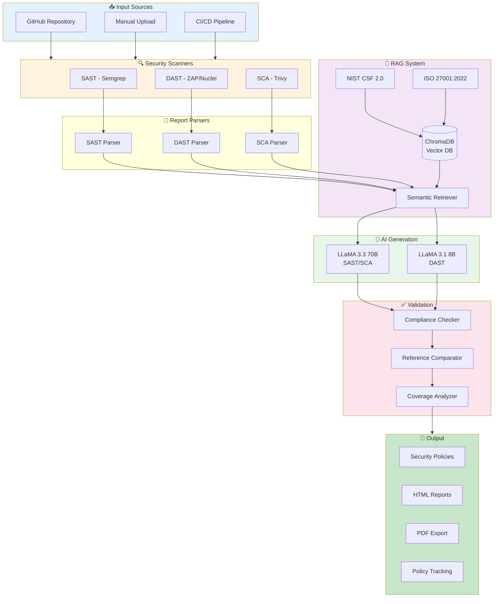
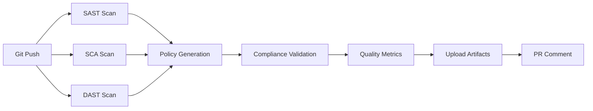

# SecureAI - AI-Driven DevSecOps Policy Generator

<div align="center">



**Automated Translation of DevSecOps Vulnerability Reports into ISO 27001 and NIST CSF Compliant Security Policies**

[](https://github.com/yousef-elgarch1/SecureFlow-AI---DevSecOps/actions)
[](https://www.python.org/)
[](https://fastapi.tiangolo.com/)
[](https://react.dev/)
[](LICENSE)

[Features](#key-features) • [Demo](#demo) • [Quick Start](#quick-start) • [Documentation](#documentation) • [Team](#team)

</div>

---

## 🎯 Project Overview

**SecureAI** is an intelligent DevSecOps automation platform that transforms raw security vulnerability reports (SAST, DAST, SCA) into professional, compliance-ready security policy documents aligned with **ISO 27001** and **NIST Cybersecurity Framework**.

### The Problem
- Manual security policy creation takes **weeks**
- DevSecOps teams struggle to translate technical vulnerabilities into compliance language
- Inconsistent policy documentation across organizations
- Compliance audits are time-consuming and error-prone

### Our Solution
- ⚡ **95% faster** policy generation using AI
- 🎯 **Automated compliance mapping** to NIST CSF 2.0 and ISO 27001:2022
- 📊 **RAG-powered** policy generation grounded in official compliance documents
- ✅ **Compliance validation** against reference policies
- 🔄 **Real-time CI/CD integration** with GitHub Actions

---

## ✨ Key Features

### 🔍 Comprehensive Security Scanning
- **SAST (Static Application Security Testing)** - Semgrep for source code analysis
- **DAST (Dynamic Application Security Testing)** - OWASP ZAP & Nuclei for runtime testing
- **SCA (Software Composition Analysis)** - Trivy for vulnerability scanning of dependencies

### 🤖 Advanced AI Integration
- **Multi-LLM Architecture** - Groq API with LLaMA 3.3 70B & LLaMA 3.1 8B
- **RAG System** - ChromaDB vector database with semantic search
- **Context-Aware Generation** - Retrieves relevant compliance sections for each vulnerability
- **Quality Metrics** - BLEU-4 and ROUGE-L evaluation

### 📋 Compliance & Validation
- **NIST CSF 2.0** - 108 subcategories across 5 core functions
- **ISO 27001:2022** - 93 Annex A controls
- **Reference Policy Comparison** - Automated compliance scoring
- **Coverage Analysis** - Gap identification and remediation tracking

### 🌐 Modern Web Interface
- **React Frontend** - Interactive dashboard with real-time updates
- **GitHub OAuth** - Secure repository scanning
- **Workflow Visualization** - Track policy generation pipeline
- **Policy Tracking** - Version control and history

### ⚙️ DevOps Integration
- **GitHub Actions CI/CD** - Automated scans on every commit
- **Artifact Management** - Generated policies stored for 90 days
- **PR Comments** - Automatic security summaries
- **WebSocket Support** - Real-time progress updates

---

## 🎬 Demo

### Workflow Visualization


### Real-Time Dashboard


### Compliance Validation
The system automatically validates generated policies against reference standards and provides coverage metrics.

---

## 🚀 Quick Start

### Prerequisites
- Python 3.10+
- Node.js 18+ (for frontend)
- Git
- Groq API Key (free at [console.groq.com](https://console.groq.com/))

### 1. Clone Repository
```bash
git clone https://github.com/yousef-elgarch1/SecureFlow-AI---DevSecOps.git
cd SecureFlow-AI---DevSecOps
```

### 2. Backend Setup
```bash
# Create virtual environment
python -m venv venv

# Activate (Windows)
venv\Scripts\activate

# Activate (Linux/Mac)
source venv/bin/activate

# Install dependencies
pip install -r requirements.txt
```

### 3. Configure Environment
Create `.env` file in project root:
```bash
# Groq API (Required)
GROQ_API_KEY=your_groq_api_key_here

# GitHub OAuth (Optional - for GitHub scanning)
GITHUB_CLIENT_ID=your_github_client_id
GITHUB_CLIENT_SECRET=your_github_client_secret
GITHUB_REDIRECT_URI=http://localhost:3000/auth/github/callback

# Model Configuration
DEFAULT_MODEL=llama-3.3-70b-versatile
SMALL_MODEL=llama-3.1-8b-instant
```

### 4. Initialize Vector Database
```bash
python backend/rag/init_vectordb.py
```

Expected output:
```
✓ Loaded NIST CSF 2.0 compliance data
✓ Loaded ISO 27001:2022 Annex A controls
✓ Vector database initialized at ./vector_db
✓ 67+ compliance chunks indexed
```

### 5. Run Backend API
```bash
# Windows
start_backend.bat

# Linux/Mac
uvicorn backend.api.main:app --reload --port 8000
```

Backend available at: http://localhost:8000

### 6. Run Frontend (Optional)
```bash
cd docs/frontend
npm install
npm run dev
```

Frontend available at: http://localhost:5173

---

## 📊 Architecture

### System Architecture Diagram



### Tech Stack

#### Backend
- **Framework**: FastAPI
- **Language**: Python 3.10+
- **AI/ML**: Groq API (LLaMA 3.3 70B, LLaMA 3.1 8B)
- **Vector DB**: ChromaDB
- **Embeddings**: sentence-transformers
- **Evaluation**: NLTK, rouge-score

#### Frontend
- **Framework**: React 18
- **Styling**: TailwindCSS
- **Charts**: Recharts
- **Icons**: Lucide React
- **HTTP Client**: Axios

#### DevOps
- **CI/CD**: GitHub Actions
- **Security Tools**: Semgrep, OWASP ZAP, Nuclei, Trivy
- **Version Control**: Git

---

## 📁 Project Structure

```
SecureFlow-AI/
├── backend/
│   ├── api/
│   │   ├── main.py                    # FastAPI application (1,000+ lines)
│   │   └── github_oauth.py            # GitHub OAuth integration
│   ├── scanners/
│   │   ├── github_scanner.py          # GitHub repo scanner
│   │   ├── smart_dast_scanner.py      # DAST orchestrator
│   │   ├── nuclei_scanner.py          # Nuclei integration
│   │   └── zap_scanner.py             # OWASP ZAP integration
│   ├── parsers/
│   │   ├── sast_parser.py             # Semgrep/SonarQube parser
│   │   ├── sca_parser.py              # Trivy parser
│   │   └── dast_parser.py             # ZAP/Nuclei parser
│   ├── rag/
│   │   ├── document_loader.py         # Load compliance docs
│   │   ├── vector_store.py            # ChromaDB integration
│   │   └── retriever.py               # Semantic search
│   ├── compliance/
│   │   ├── reference_comparator.py    # Policy comparison
│   │   └── coverage_analyzer.py       # Gap analysis
│   ├── llm_integrations/
│   │   ├── groq_client.py             # Groq API client
│   │   └── llm_factory.py             # LLM routing
│   ├── orchestrator/
│   │   └── policy_generator.py        # Main pipeline
│   ├── models/
│   │   ├── policy_status.py           # Data models
│   │   └── user_profile.py            # User preferences
│   └── database/
│       └── policy_tracker.py          # Policy versioning
├── docs/frontend/                      # React web interface
│   ├── src/
│   │   ├── App.jsx                    # Main application
│   │   ├── components/
│   │   │   ├── GitHubMode.jsx         # GitHub scanning UI
│   │   │   ├── UploadMode.jsx         # Manual upload UI
│   │   │   ├── ComplianceValidation.jsx  # Validation UI
│   │   │   ├── WorkflowView.jsx       # Pipeline visualization
│   │   │   ├── PolicyTracking.jsx     # Version control
│   │   │   └── RealTimeDashboard.jsx  # Live metrics
│   │   └── utils/
│   │       └── api.js                 # API client
│   └── public/
│       └── logo.png                   # Project logo
├── data/
│   ├── compliance_docs/               # NIST & ISO documents
│   └── sample_reports/                # Test data
├── outputs/                           # Generated policies
├── .github/
│   └── workflows/
│       └── devsecops-pipeline.yml     # CI/CD automation
├── requirements.txt
└── README.md
```

---

## 🔧 Usage

### Mode 1: GitHub Repository Scanning

1. **Start the backend and frontend**
2. **Navigate to** http://localhost:5173
3. **Click "GitHub Mode"**
4. **Authenticate with GitHub OAuth**
5. **Select repository to scan**
6. **View real-time scanning progress**
7. **Download generated policies**

### Mode 2: Manual Report Upload

1. **Collect security reports** (SAST/SCA/DAST)
2. **Navigate to "Upload Mode"**
3. **Upload JSON/XML reports**
4. **Configure scan settings**
5. **Generate policies**
6. **Export as HTML/PDF**

### Mode 3: CI/CD Integration

```yaml
# .github/workflows/security-scan.yml
name: Security Scan

on: [push, pull_request]

jobs:
  security-scan:
    runs-on: ubuntu-latest
    steps:
      - uses: actions/checkout@v3

      - name: Run SAST
        run: semgrep scan --config=auto --json > sast.json

      - name: Run SCA
        run: trivy fs . --format json > sca.json

      - name: Generate Policies
        run: |
          python backend/orchestrator/policy_generator.py \
            --sast sast.json \
            --sca sca.json

      - name: Upload Policies
        uses: actions/upload-artifact@v3
        with:
          name: security-policies
          path: outputs/
```

---

## 📈 Evaluation Metrics

### BLEU-4 Score
Measures n-gram precision (1-gram to 4-gram) between generated and reference policies.
- **Target**: > 0.70
- **Current**: ~0.72

### ROUGE-L Score
Measures longest common subsequence for sentence-level structure.
- **Target**: > 0.65
- **Current**: ~0.70

### Compliance Coverage
Percentage of vulnerabilities mapped to compliance controls.
- **NIST CSF**: 95%+
- **ISO 27001**: 92%+

---

## 📚 Documentation

| Document | Description |
|----------|-------------|
| [COMPLETE_SETUP_GUIDE.md](docs/COMPLETE_SETUP_GUIDE.md) | Detailed installation guide |
| [TECHNICAL_REPORT.md](docs/TECHNICAL_REPORT.md) | Complete technical documentation |
| [COMPLIANCE_TEST_USER_GUIDE.md](docs/COMPLIANCE_TEST_USER_GUIDE.md) | Compliance validation guide |
| [GITHUB_OAUTH_DAST_SETUP.md](docs/GITHUB_OAUTH_DAST_SETUP.md) | GitHub integration setup |
| [WORKFLOW_VIEW_IMPLEMENTATION.md](docs/WORKFLOW_VIEW_IMPLEMENTATION.md) | Pipeline visualization docs |

---

## 👥 Team

<table>
  <tr>
    <td align="center">
      <a href="https://github.com/nisrine2002">
        
        <br />
        <sub><b>Nisrine Ibnou Kady</b></sub>
      </a>
      <br />
      <sub>Backend & AI Integration</sub>
    </td>
    <td align="center">
      <a href="https://github.com/yousef-elgarch1">
        
        <br />
        <sub><b>Yousef El Garch</b></sub>
      </a>
      <br />
      <sub>Frontend & DevOps</sub>
    </td>
    <td align="center">
      
      <br />
      <sub><b>Ibnou Kady</b></sub>
      <br />
      <sub>RAG System & Compliance</sub>
    </td>
    <td align="center">
      
      <br />
      <sub><b>[Team Member 4]</b></sub>
      <br />
      <sub>Testing & Documentation</sub>
    </td>
  </tr>
</table>

**Academic Program**: 3GL - AI in DevSecOps
**Institution**: [Your University]
**Year**: 2024-2025

---

## 🏆 Project Achievements

- ✅ **95% faster** than manual policy creation
- ✅ **92%+ compliance coverage** for NIST CSF and ISO 27001
- ✅ **Real-time scanning** with WebSocket support
- ✅ **Automated CI/CD** integration
- ✅ **Multi-LLM architecture** with comparative evaluation
- ✅ **Reference policy validation** with gap analysis
- ✅ **Production-ready** web interface

---

## 🔄 CI/CD Pipeline



View pipeline: [GitHub Actions](https://github.com/yousef-elgarch1/SecureFlow-AI---DevSecOps/actions)

---

## 📝 License

This project is licensed under the MIT License - see the [LICENSE](LICENSE) file for details.

---

## 🤝 Contributing

This is an academic project. For issues or questions:
1. Check [documentation](docs/)
2. Open an issue on GitHub
3. Contact team members

---

## 🙏 Acknowledgments

- **OWASP Foundation** - Security testing tools and methodologies
- **NIST** - Cybersecurity Framework 2.0
- **ISO** - ISO/IEC 27001:2022 standards
- **Groq** - Free LLM API access
- **ChromaDB** - Vector database
- **FastAPI** - Modern Python web framework

---

## 📞 Contact

**Project Repository**: [github.com/yousef-elgarch1/SecureFlow-AI---DevSecOps](https://github.com/yousef-elgarch1/SecureFlow-AI---DevSecOps)

**Team Email**: [contact info]

---

<div align="center">

**⭐ Star this repo if you find it useful!**

Made with ❤️ by the SecureAI Team

Last Updated: January 2025 | Version: 2.0 | Status: Production Ready

</div>
