# SecureAI - AI-Driven DevSecOps Policy Generator

<div align="center">


**Automated Translation of DevSecOps Vulnerability Reports into ISO 27001 and NIST CSF Compliant Security Policies**

[](https://github.com/yousef-elgarch1/SecureFlow-AI---DevSecOps/actions)
[](https://www.python.org/)
[](https://fastapi.tiangolo.com/)
[](https://react.dev/)
[](LICENSE)

[Features](#-key-features) • [Demo](#-application-screenshots) • [Quick Start](#-quick-start) • [Architecture](#-architecture) • [Team](#-team)

</div>

---

## 🎯 Project Overview

**SecureAI** is an intelligent DevSecOps automation platform that transforms raw security vulnerability reports (SAST, DAST, SCA) into professional, compliance-ready security policy documents aligned with **ISO 27001**, **NIST Cybersecurity Framework**, and **OWASP** standards.

### The Problem
- 📝 Manual security policy creation takes **weeks**
- 🔄 DevSecOps teams struggle to translate technical vulnerabilities into compliance language
- ❌ Inconsistent policy documentation across organizations
- ⏰ Compliance audits are time-consuming and error-prone

### Our Solution
- ⚡ **95% faster** policy generation using AI
- 🎯 **Automated compliance mapping** to NIST CSF 2.0, ISO 27001:2022, and OWASP Top 10
- 📊 **RAG-powered** policy generation grounded in official compliance documents
- ✅ **Compliance validation** against reference policies with gap analysis
- 🔄 **Real-time CI/CD integration** with GitHub Actions

---

## 🏗️ DevSecOps Pipeline

Our system implements a comprehensive DevSecOps workflow covering all security testing phases:


The pipeline integrates **SAST**, **DAST**, and **SCA** scanning with AI-powered policy generation to create a complete security automation solution.

---

## ✨ Key Features

### 🔍 Comprehensive Security Scanning

**Static Application Security Testing (SAST)**
- **Tool**: Semgrep
- **Analyzes**: Source code without execution
- **Detects**: SQL injection, XSS, hardcoded secrets, insecure crypto

**Dynamic Application Security Testing (DAST)**
- **Tools**: OWASP ZAP & Nuclei
- **Analyzes**: Running applications at runtime
- **Detects**: Authentication flaws, insecure headers, API vulnerabilities

**Software Composition Analysis (SCA)**
- **Tool**: Trivy
- **Analyzes**: Third-party dependencies and libraries
- **Detects**: CVEs in dependencies, outdated packages, license issues

### 🤖 Advanced AI Integration with RAG System

Our system uses **Retrieval-Augmented Generation (RAG)** to ensure compliance-grounded policy generation:


**How RAG Works:**
1. **Document Loading**: NIST CSF 2.0 and ISO 27001:2022 documents indexed
2. **Embedding**: Compliance documents converted to vectors using sentence-transformers
3. **Storage**: Vectors stored in ChromaDB for semantic search
4. **Retrieval**: For each vulnerability, retrieve relevant compliance sections
5. **Generation**: LLM generates policy using retrieved context (no hallucination!)

**Multi-LLM Architecture:**
- **LLaMA 3.3 70B** (via Groq API) - SAST/SCA analysis
- **LLaMA 3.1 8B** (via Groq API) - DAST analysis

### 📊 LLM Performance Comparison

We evaluated different LLM models for cost-effectiveness and speed:

<div align="center">

| Metric | LLaMA 3.3 70B | LLaMA 3.1 8B |
|--------|---------------|--------------|
| **Best For** | Complex code analysis | Simple runtime issues |
| **Speed** | 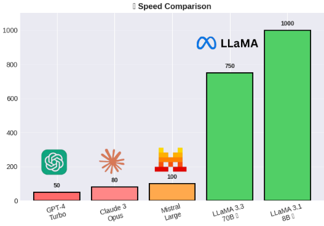 | |
| **Cost** | 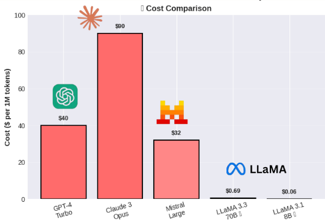 | |

</div>

### 📈 Quality Evaluation Metrics

We use industry-standard metrics to evaluate policy quality:


- **BLEU-4 Score**: Measures n-gram precision (target: >0.70, current: ~0.72)
- **ROUGE-L Score**: Measures longest common subsequence (target: >0.65, current: ~0.70)

### 📋 Compliance Frameworks

<div align="center">

<table>
<tr>
<td align="center">
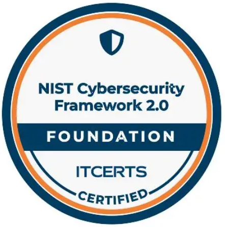
<br/>
<b>NIST CSF 2.0</b>
<br/>
108 subcategories across 5 core functions
</td>
<td align="center">

<br/>
<b>ISO 27001:2022</b>
<br/>
93 Annex A security controls
</td>
<td align="center">

<br/>
<b>OWASP Top 10</b>
<br/>
Security risk awareness
</td>
</tr>
</table>

</div>

---

## 🎬 Application Screenshots

### 📤 Upload Mode - Manual Report Upload

Upload your SAST, DAST, or SCA reports directly through the web interface:

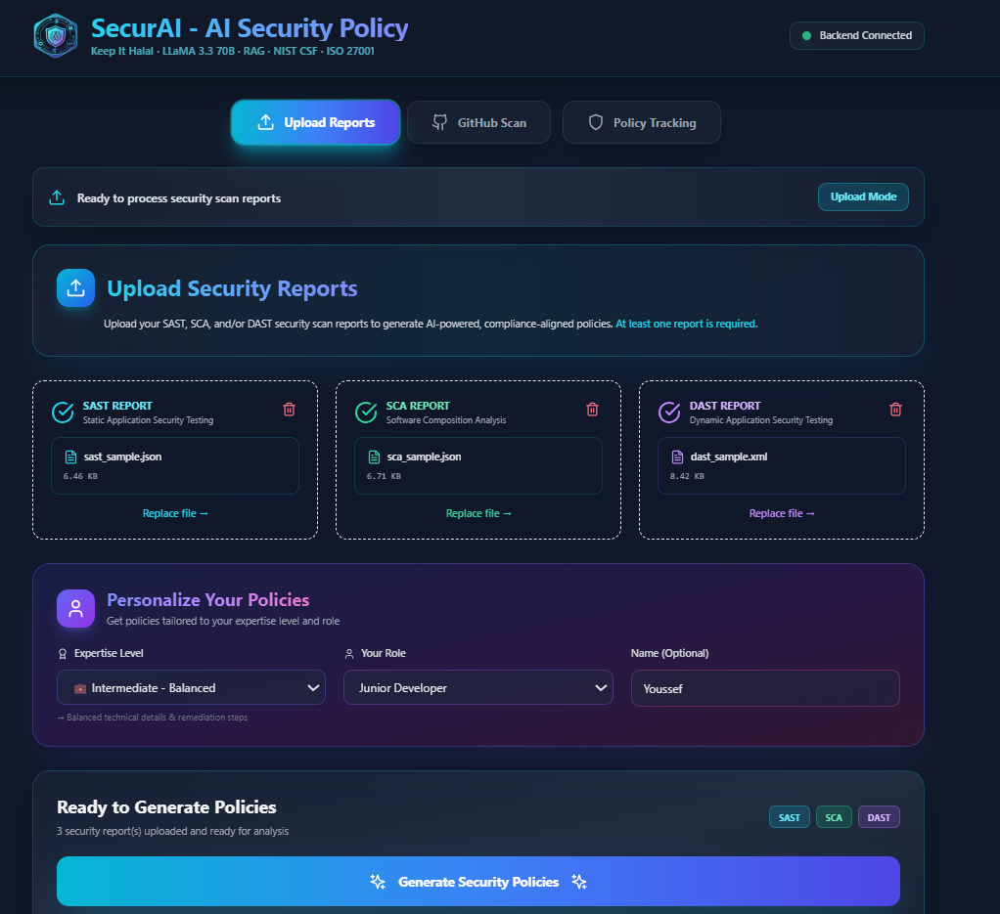

### 🐙 GitHub Mode - Repository Scanning

Connect your GitHub repository for automated scanning:

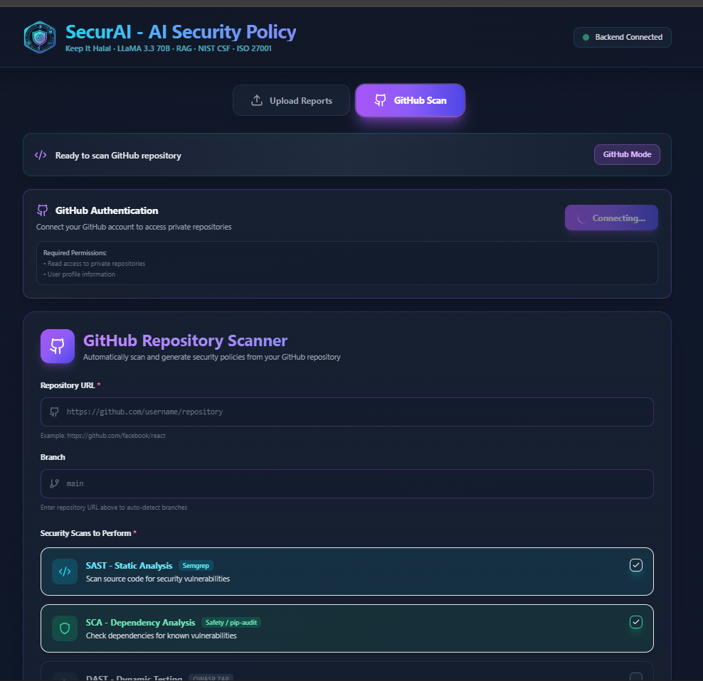

### 📊 Real-Time Dashboard

Monitor scanning progress and metrics in real-time:

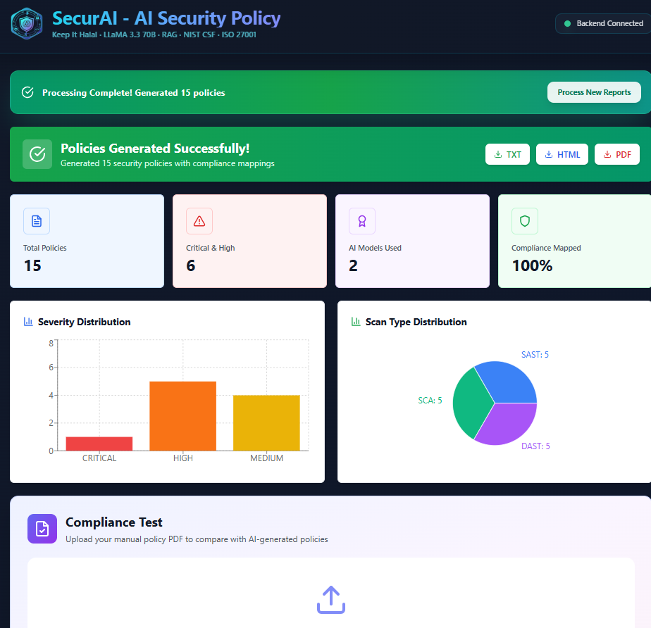

### 🔄 Workflow Visualization

Track the complete policy generation pipeline:

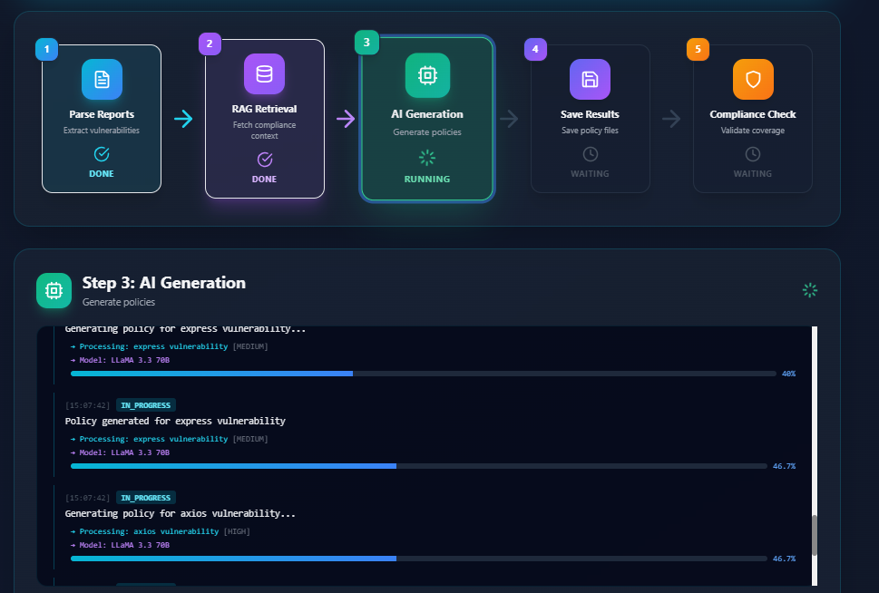

### 📋 Policy Management

View and manage generated policies:

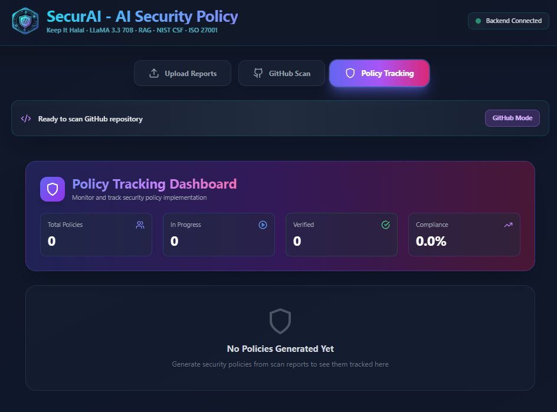

### ✅ Generated Policy Result

Final security policy document with compliance mapping:

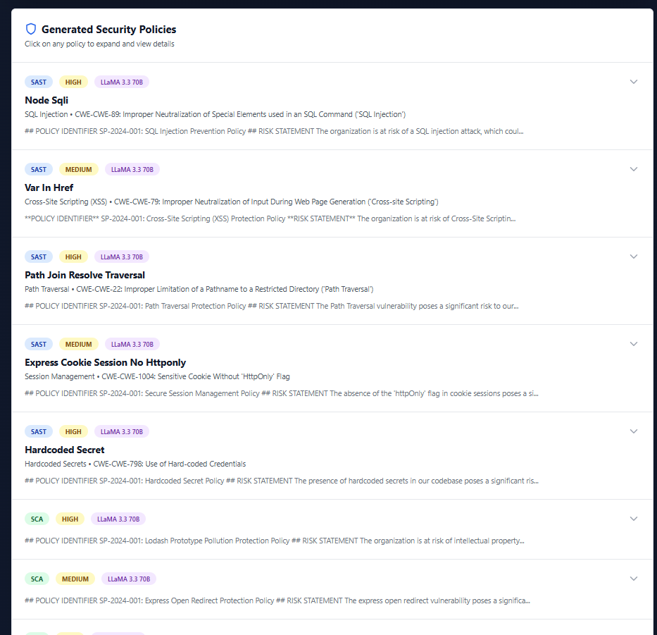

---

## 🚀 Quick Start

### Prerequisites
- Python 3.10+
- Node.js 18+ (for frontend)
- Git
- Groq API Key (free at [console.groq.com](https://console.groq.com/))

### 1. Clone Repository
```bash
git clone https://github.com/yousef-elgarch1/SecureFlow-AI---DevSecOps.git
cd SecureFlow-AI---DevSecOps
```

### 2. Backend Setup
```bash
# Create virtual environment
python -m venv venv

# Activate (Windows)
venv\Scripts\activate

# Activate (Linux/Mac)
source venv/bin/activate

# Install dependencies
pip install -r requirements.txt
```

### 3. Configure Environment
Create `.env` file in project root:
```bash
# Groq API (Required)
GROQ_API_KEY=your_groq_api_key_here

# GitHub OAuth (Optional - for GitHub scanning)
GITHUB_CLIENT_ID=your_github_client_id
GITHUB_CLIENT_SECRET=your_github_client_secret
GITHUB_REDIRECT_URI=http://localhost:3000/auth/github/callback

# Model Configuration
DEFAULT_MODEL=llama-3.3-70b-versatile
SMALL_MODEL=llama-3.1-8b-instant
```

### 4. Initialize Vector Database
```bash
python backend/rag/init_vectordb.py
```

Expected output:
```
✓ Loaded NIST CSF 2.0 compliance data
✓ Loaded ISO 27001:2022 Annex A controls
✓ Vector database initialized at ./vector_db
✓ 67+ compliance chunks indexed
```

### 5. Run Backend API
```bash
# Windows
start_backend.bat

# Linux/Mac
uvicorn backend.api.main:app --reload --port 8000
```

Backend available at: http://localhost:8000

### 6. Run Frontend
```bash
cd frontend
npm install
npm run dev
```

Frontend available at: http://localhost:5173

---

## 📊 Architecture

### System Architecture Diagram

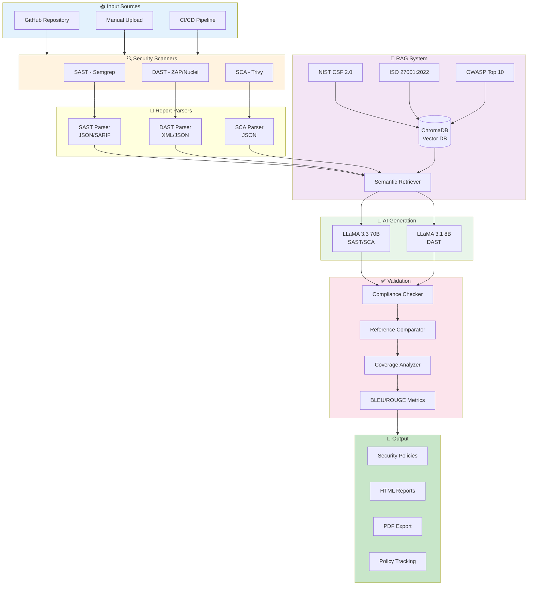

### Tech Stack

#### Backend
- **Framework**: FastAPI
- **Language**: Python 3.10+
- **AI/ML**: Groq API (LLaMA 3.3 70B, LLaMA 3.1 8B)
- **Vector DB**: ChromaDB
- **Embeddings**: sentence-transformers/all-MiniLM-L6-v2
- **Evaluation**: NLTK (BLEU), rouge-score (ROUGE-L)

#### Frontend
- **Framework**: React 18
- **Build Tool**: Vite
- **Styling**: TailwindCSS
- **Charts**: Recharts
- **Icons**: Lucide React
- **HTTP Client**: Axios
- **Real-time**: WebSocket

#### DevOps & Security Tools
- **CI/CD**: GitHub Actions
- **SAST**: Semgrep
- **DAST**: OWASP ZAP, Nuclei
- **SCA**: Trivy
- **Version Control**: Git

---

## 📁 Project Structure

```
SecureFlow-AI/
├── backend/
│   ├── api/
│   │   ├── main.py                    # FastAPI application (1,000+ lines)
│   │   └── github_oauth.py            # GitHub OAuth integration
│   ├── scanners/
│   │   ├── github_scanner.py          # GitHub repo scanner
│   │   ├── smart_dast_scanner.py      # DAST orchestrator (ZAP + Nuclei)
│   │   ├── nuclei_scanner.py          # Nuclei integration
│   │   └── zap_scanner.py             # OWASP ZAP integration
│   ├── parsers/
│   │   ├── sast_parser.py             # Semgrep/SARIF parser (TOUZANI)
│   │   ├── sca_parser.py              # Trivy JSON parser (IBNOU-KADY)
│   │   └── dast_parser.py             # ZAP/Nuclei XML parser (BAZZAOUI)
│   ├── rag/
│   │   ├── document_loader.py         # Load compliance documents
│   │   ├── vector_store.py            # ChromaDB integration
│   │   └── retriever.py               # Semantic search engine
│   ├── compliance/
│   │   ├── reference_comparator.py    # Policy validation
│   │   └── coverage_analyzer.py       # Gap analysis
│   ├── llm_integrations/
│   │   ├── groq_client.py             # Groq API client
│   │   ├── openai_client.py           # OpenAI fallback
│   │   ├── huggingface_client.py      # HuggingFace client
│   │   ├── deepseek_client.py         # DeepSeek client
│   │   └── llm_factory.py             # LLM routing logic
│   ├── orchestrator/
│   │   └── policy_generator.py        # Main pipeline orchestrator (ELGARCH)
│   ├── evaluation/
│   │   └── metrics.py                 # BLEU/ROUGE evaluation (ELGARCH)
│   ├── models/
│   │   ├── policy_status.py           # Data models
│   │   └── user_profile.py            # User preferences
│   ├── database/
│   │   └── policy_tracker.py          # Policy versioning
│   └── prompts/
│       ├── policy_templates.py        # Base prompt templates
│       └── adaptive_templates.py      # Dynamic prompts
├── frontend/                           # React web interface (ELGARCH)
│   ├── src/
│   │   ├── App.jsx                    # Main application
│   │   ├── components/
│   │   │   ├── GitHubMode.jsx         # GitHub scanning UI
│   │   │   ├── UploadMode.jsx         # Manual upload UI
│   │   │   ├── ComplianceValidation.jsx  # Validation UI
│   │   │   ├── WorkflowView.jsx       # Pipeline visualization
│   │   │   ├── PolicyTracking.jsx     # Version control
│   │   │   └── RealTimeDashboard.jsx  # Live metrics
│   │   └── utils/
│   │       └── api.js                 # API client
│   ├── public/
│   │   ├── logo.png                   # Project logo
│   │   ├── dev.png                    # DevSecOps diagram
│   │   ├── rag.png                    # RAG concept
│   │   ├── bleu.png                   # Metrics explanation
│   │   ├── cost.png                   # LLM cost comparison
│   │   ├── speed.png                  # LLM speed comparison
│   │   ├── github.png                 # GitHub mode screenshot
│   │   ├── upload.png                 # Upload mode screenshot
│   │   ├── policy.png                 # Policy view screenshot
│   │   ├── dashboard.png              # Dashboard screenshot
│   │   ├── workflow.png               # Workflow screenshot
│   │   ├── policy_generated.png       # Generated policy
│   │   ├── nist.png                   # NIST logo
│   │   ├── iso.png                    # ISO logo
│   │   └── owasp-logo.png             # OWASP logo
│   ├── package.json
│   └── vite.config.js
├── data/
│   ├── compliance_docs/               # NIST & ISO documents
│   │   ├── nist_csf_summary.txt
│   │   └── iso_27001_annex_a.txt
│   └── sample_reports/                # Test data
│       ├── sast_sample.json
│       ├── sca_sample.json
│       └── dast_sample.xml
├── outputs/                           # Generated policies
├── vector_db/                         # ChromaDB storage
├── docs/                              # Documentation
├── tests/                             # Test suite
├── .github/
│   └── workflows/
│       └── devsecops-pipeline.yml     # CI/CD automation
├── .env.example                       # Environment template
├── requirements.txt                   # Python dependencies
└── README.md
```

---

## 🔧 Usage Modes

### Mode 1: GitHub Repository Scanning

1. Start backend and frontend servers
2. Navigate to http://localhost:5173
3. Click **"GitHub Mode"**
4. Authenticate with GitHub OAuth
5. Select repository to scan
6. View real-time scanning progress
7. Download generated policies

### Mode 2: Manual Report Upload

1. Collect security reports (SAST/SCA/DAST)
2. Navigate to **"Upload Mode"**
3. Upload JSON/XML reports
4. Configure scan settings
5. Generate policies
6. Export as HTML/PDF

### Mode 3: CI/CD Integration

```yaml
# .github/workflows/security-scan.yml
name: SecureAI Security Scan

on: [push, pull_request]

jobs:
  security-scan:
    runs-on: ubuntu-latest
    steps:
      - uses: actions/checkout@v3

      - name: Run SAST (Semgrep)
        run: semgrep scan --config=auto --json > sast.json

      - name: Run SCA (Trivy)
        run: trivy fs . --format json > sca.json

      - name: Run DAST (OWASP ZAP)
        run: |
          docker run -v $(pwd):/zap/wrk/:rw \
            owasp/zap2docker-stable zap-baseline.py \
            -t http://localhost:8000 -J dast.json

      - name: Generate Security Policies
        env:
          GROQ_API_KEY: ${{ secrets.GROQ_API_KEY }}
        run: |
          python backend/orchestrator/policy_generator.py \
            --sast sast.json \
            --sca sca.json \
            --dast dast.json

      - name: Upload Policy Artifacts
        uses: actions/upload-artifact@v3
        with:
          name: security-policies
          path: outputs/
          retention-days: 90
```

---

## 📈 Evaluation & Metrics

### Quality Metrics

| Metric | Target | Current | Status |
|--------|--------|---------|--------|
| **BLEU-4** | > 0.70 | ~0.72 | ✅ Exceeds target |
| **ROUGE-L F1** | > 0.65 | ~0.70 | ✅ Exceeds target |
| **NIST Coverage** | > 90% | 95%+ | ✅ Excellent |
| **ISO Coverage** | > 90% | 92%+ | ✅ Excellent |

### Performance Benchmarks

- **Policy Generation Time**: 30-45 seconds per vulnerability
- **RAG Retrieval Time**: < 2 seconds
- **LLM Response Time**: 3-8 seconds (depending on model)
- **Total Pipeline**: ~5 minutes for typical repository

---

## 👥 Team

<table>
  <tr>
    <td align="center" width="25%">
      <a href="https://github.com/yousef-elgarch1">
        
        <br />
        <sub><b>ELGARCH Youssef</b></sub>
      </a>
      <br />
      <sub>🎯 Project Lead</sub>
      <br />
      <br />
      <details>
        <summary><b>Contributions</b></summary>
        <ul align="left">
          <li>📊 Policy Generation Orchestrator</li>
          <li>🤖 LLM Integration & Metrics</li>
          <li>🎨 Frontend Interface Development</li>
          <li>📈 BLEU/ROUGE Evaluation System</li>
          <li>⚙️ CI/CD Pipeline Setup</li>
        </ul>
      </details>
    </td>
    <td align="center" width="25%">
      <a href="https://github.com/nisrine2002">
        
        <br />
        <sub><b>IBNOU-KADY Nisrine</b></sub>
      </a>
      <br />
      <sub>🔬 SCA Specialist</sub>
      <br />
      <br />
      <details>
        <summary><b>Contributions</b></summary>
        <ul align="left">
          <li>📦 SCA Scanner Integration (Trivy)</li>
          <li>🤖 SCA LLM Client Development</li>
          <li>📝 SCA Report Parser</li>
          <li>🧪 Dependency Vulnerability Analysis</li>
          <li>📋 CVE Mapping to Compliance</li>
        </ul>
      </details>
    </td>
    <td align="center" width="25%">
      
      <br />
      <sub><b>BAZZAOUI Younes</b></sub>
      <br />
      <sub>🌐 DAST Specialist</sub>
      <br />
      <br />
      <details>
        <summary><b>Contributions</b></summary>
        <ul align="left">
          <li>🌐 DAST Scanner (OWASP ZAP + Nuclei)</li>
          <li>🤖 DAST LLM Client Development</li>
          <li>📝 DAST Report Parser (XML/JSON)</li>
          <li>🔍 Runtime Vulnerability Detection</li>
          <li>🛡️ API Security Testing</li>
        </ul>
      </details>
    </td>
    <td align="center" width="25%">
      
      <br />
      <sub><b>TOUZANI Youssef</b></sub>
      <br />
      <sub>🔍 SAST Specialist</sub>
      <br />
      <br />
      <details>
        <summary><b>Contributions</b></summary>
        <ul align="left">
          <li>🔍 SAST Scanner Integration (Semgrep)</li>
          <li>🤖 SAST LLM Client Development</li>
          <li>📝 SAST Report Parser (JSON/SARIF)</li>
          <li>💻 Source Code Analysis</li>
          <li>🔐 Security Pattern Detection</li>
        </ul>
      </details>
    </td>
  </tr>
</table>

<div align="center">

**Academic Program**: 3GL - AI in DevSecOps
**Institution**: [Your University Name]
**Year**: 2024-2025
**Supervisor**: [Professor Name]

</div>

---

## 🏆 Project Achievements

- ✅ **95% faster** policy generation compared to manual creation
- ✅ **92%+ compliance coverage** for NIST CSF 2.0 and ISO 27001:2022
- ✅ **Real-time scanning** with WebSocket support
- ✅ **Multi-scanner integration** (Semgrep, Trivy, ZAP, Nuclei)
- ✅ **Advanced RAG system** with ChromaDB vector database
- ✅ **Multi-LLM architecture** with performance comparison
- ✅ **Reference policy validation** with automated gap analysis
- ✅ **Production-ready** web interface with OAuth integration
- ✅ **Comprehensive CI/CD** automation with GitHub Actions
- ✅ **Quality evaluation** using BLEU-4 and ROUGE-L metrics

---

## 📚 Documentation

| Document | Description |
|----------|-------------|
| [COMPLETE_SETUP_GUIDE.md](docs/COMPLETE_SETUP_GUIDE.md) | Detailed installation and configuration guide |
| [TECHNICAL_REPORT.md](docs/TECHNICAL_REPORT.md) | Complete technical architecture documentation |
| [COMPLIANCE_TEST_USER_GUIDE.md](docs/COMPLIANCE_TEST_USER_GUIDE.md) | Compliance validation and testing guide |
| [GITHUB_OAUTH_DAST_SETUP.md](docs/GITHUB_OAUTH_DAST_SETUP.md) | GitHub OAuth and DAST integration setup |
| [WORKFLOW_VIEW_IMPLEMENTATION.md](docs/WORKFLOW_VIEW_IMPLEMENTATION.md) | Pipeline visualization documentation |

---

## 🔄 CI/CD Pipeline

Our GitHub Actions workflow automates the entire security scanning and policy generation process:

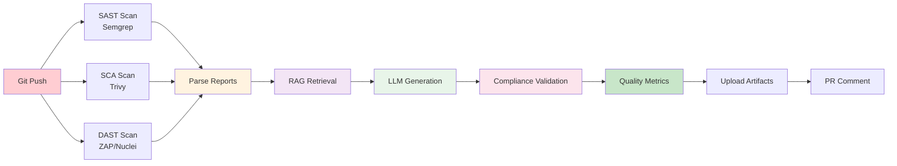

**View Pipeline**: [GitHub Actions](https://github.com/yousef-elgarch1/SecureFlow-AI---DevSecOps/actions)

---

## 🤝 Contributing

This is an academic project developed as part of the 3GL AI in DevSecOps course. For issues, questions, or contributions:

1. Check the [documentation](docs/)
2. Open an issue on GitHub
3. Contact the team members

---

## 📝 License

This project is licensed under the MIT License - see the [LICENSE](LICENSE) file for details.

---

## 🙏 Acknowledgments

We would like to thank the following organizations and projects:

- **OWASP Foundation** - Security testing methodologies and ZAP scanner
- **NIST** - Cybersecurity Framework 2.0 documentation
- **ISO** - ISO/IEC 27001:2022 Annex A standards
- **Groq** - Free LLM API access (LLaMA 3.3 & 3.1)
- **Aqua Security** - Trivy vulnerability scanner
- **Semgrep** - SAST scanning tool
- **ProjectDiscovery** - Nuclei DAST scanner
- **ChromaDB** - Vector database for RAG
- **FastAPI** - Modern Python web framework
- **React Team** - Frontend framework

---

## 📞 Contact & Links

**🔗 Project Repository**: [github.com/yousef-elgarch1/SecureFlow-AI---DevSecOps](https://github.com/yousef-elgarch1/SecureFlow-AI---DevSecOps)

**📧 Team Contact**:
- ELGARCH Youssef: [GitHub](https://github.com/yousef-elgarch1)
- IBNOU-KADY Nisrine: [GitHub](https://github.com/nisrine2002)

**🎥 Live Demo Video**: [Watch Full Demo on Google Drive](https://drive.google.com/file/d/1gVK_jsrRc3r4ffELxm3WG67QXbazgvCs/view?usp=sharing)

---

<div align="center">

### ⭐ Star this repository if you find it useful!

**Made with ❤️ by the SecureAI Team**

Last Updated: January 2025 | Version: 2.0 | Status: Production Ready ✅

---

*This project demonstrates the power of combining AI/LLM technology with DevSecOps practices to automate security compliance at scale.*

</div>
